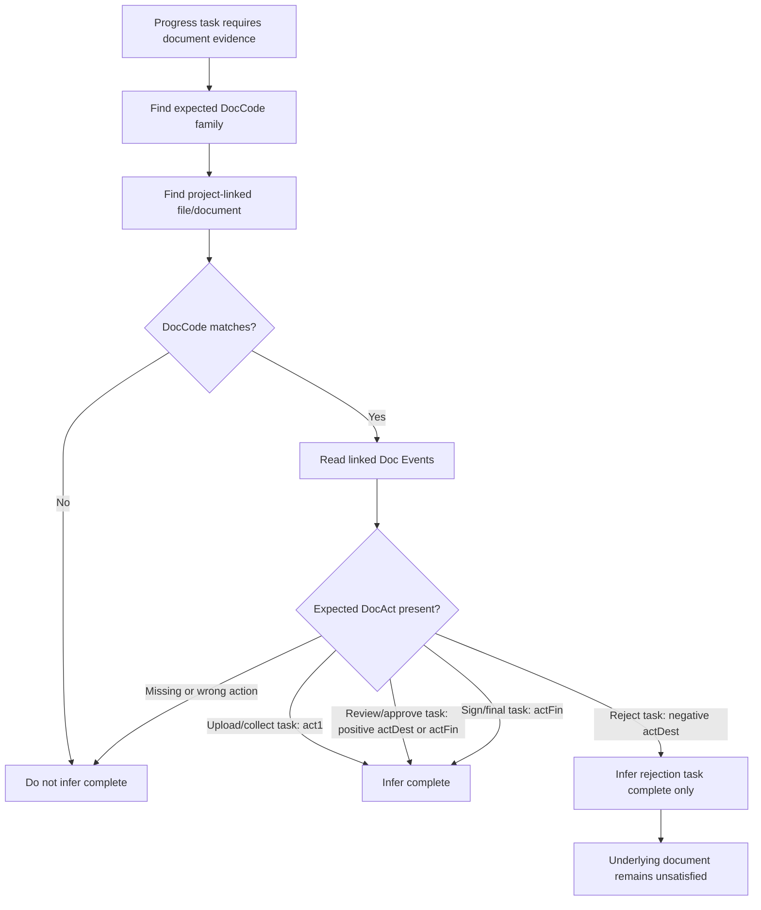

# Progress Task to DocCode x DocAct Completion Map

Sources:

- `C:\Users\bwyatt\Downloads\⚙️Progress Tasks-⚙️Progress Tasks CSV.csv`
- `C:\Users\bwyatt\Downloads\🔷Tables-docs.csv`
- [progress-tracker.md](progress-tracker.md)
- [document-classification-doc-types.md](document-classification-doc-types.md)

This document identifies which `DocCode x DocAct` combinations should be expected before document-related progress tasks can be inferred as complete.

The progress task CSV only includes `Task Title`, `phaseTaskNum`, and `Role`. It does not include the actual linked DocCode records. The mapping below therefore uses expected DocCode families derived from the task title, and the canonical DocAct slots exposed by the docs table:

- `act0`
- `act1`
- `act2`
- `actDest`
- `actFin`

## Completion Rule

For progress inference, use this default rule:

> A document-related progress task is complete when the project has a linked document with the expected `DocCode`, and the document has a positive/final `DocAct` event appropriate to that task.

The exact final action can vary by DocCode, but the expected slots are:

| DocAct slot | Expected meaning for completion inference |
|---|---|
| `act0` | Requirement/request exists. Usually not enough to complete a task by itself. |
| `act1` | File exists, was uploaded, or generated draft exists. Enough for collection/upload tasks. |
| `act2` | File was submitted for review or moved into an intermediate review step. Usually not enough for verification/approval tasks. |
| `actDest` | Review decision or destination action, such as approve, reject, request revision, or route to another step. Positive `actDest` can complete approval/verification tasks; negative `actDest` completes rejection tasks but should not satisfy the underlying required document. |
| `actFin` | Final accepted/signed/complete state. This is the safest completion signal for documents that require approval, signature, or closeout. |

## DocCode x DocAct Matrix

| Progress task | Phase | Role availability | Expected DocCode family | DocAct needed to infer this task complete | Notes |
|---|---:|---|---|---|---|
| `0. Submission: Application Submitted` | `.0` |  | Application / intake submission | `act1` or source submission event | If represented as a file/form artifact, the application DocCode only needs evidence of submission/presence. |
| `1. Intake: Collect Income Documents` | `1.4` | Admin | Income documents | `act1` | Collection is complete when required income document files are present, not necessarily verified. |
| `1. Intake: Collect Ownership Documents` | `1.4` | Admin | Ownership documents | `act1` | Collection is complete when required ownership/home documents are present. |
| `2. Processing: Verify Income Documents` | `2.1` | Admin | Income documents | positive `actDest` or `actFin` | Verification requires approval/acceptance, not just upload. Rejection/question/revision events should keep this incomplete. |
| `2. Processing: Verify Ownership Documents` | `2.1` | Admin | Ownership documents | positive `actDest` or `actFin` | Same pattern as income verification. |
| `2. Processing: Collect Program Specific Paperwork` | `2.1` |  | Program-specific accepted documentation | `act1` for collection; `actFin` if the program requires review | Use partner-program accepted documentation linked from DocCode. |
| `2. Processing: Upload Before Photos` | `2.2.1` | Assessor | Before photos | `act1` or `actFin` | If photo DocCodes do not require review, upload/presence is enough. |
| `2. Processing: Create Assessment Report` | `2.3` | Assessor | Assessment report | `act1` if generated/uploaded; `actFin` if reviewed | Generated report should link to project and assessment context. |
| `2. Processing: Create Repair Task List` | `2.4` | Project Manager | Repair task list | `act1` or `actFin` | If the task list drives later work, prefer final/accepted state. |
| `2. Processing: Create Project Scope of Work` | `2.4.2` | Project Manager | Project scope of work / SOW | `act1` for draft created; `actFin` if scope approval is required | Scope is a generated/structured document artifact. |
| `2. Processing: Upload Subcontractor Estimate` | `2.4.3` | Subcontractor, Project Manager | Subcontractor quote/estimate | `act1` | Upload task is complete on file presence. Later approval is a separate task. |
| `2. Processing: Determine Project Budget` | `2.5` | Crew Lead, Project Manager | Project budget / estimate summary | `act1` or `actFin` | Budget may be calculated rather than a document; only require DocCode if stored as a budget artifact. |
| `3. Planning: Create Contract` | `3.3` | Project Manager, Admin | Contract | `act1` | Draft/generated contract exists. Do not require signature here. |
| `3. Planning: Approve Contract` | `3.3.1` | Project Manager, Admin | Contract | positive `actDest` | Approval decision completes this task. Signed contract is separate. |
| `3. Planning: Reject Contract` | `3.3.1` | Project Manager, Admin | Contract | negative/destructive `actDest` | Completes the rejection task but should not mark contract requirement satisfied. |
| `3. Planning: Sign Contract` | `3.4` | Project Manager, Admin | Signed contract | `actFin` | Requires signature/final event. The docs CSV has `ContractSignedEvent` on subcontractor/application document records. |
| `3. Planning: Create Initial Materiasl List` | `3.5.1` | Project Manager, Crew Lead, Crew Member | Initial materials list | `act1` | Task is complete when the list artifact exists. |
| `3. Planning: Reject Subcontractor Estimate` | `3.5.1` | Project Manager, Admin | Subcontractor quote/estimate | negative/destructive `actDest` | Completes rejection task only. Should not satisfy estimate approval. |
| `3. Planning: Approve Subcontractor Estimate` | `3.5.1` | Project Manager, Admin | Subcontractor quote/estimate | positive `actDest` or `actFin` | Approval state should be explicit; upload alone is not enough. |
| `4. Project: Create Scope of Work Change Order` | `4.0` | Crew Lead, Project Manager, Admin | Scope of work change order | `act1` for created; `actFin` if approval required | If change orders require signoff, use final accepted action. |
| `4. Project: Perform Final Walkthrough` | `4.4` | Crew Lead, Crew Member, Project Manager, Admin | Final walkthrough checklist/report | `act1` or `actFin` | If the walkthrough includes signoff, use final action. |
| `4. Project: Sign Completion` | `4.5` | Crew Lead, Crew Member, Project Manager | Completion certificate / signed completion | `actFin` | Final signed completion document should be required. |
| `4. Project: Upload After Photos` | `4.6` | Crew Lead, Crew Member, Project Manager | After photos | `act1` or `actFin` | Upload/presence is usually sufficient unless review is required. |
| `4. Project: Upload Progress Photos` | `4.10.2` | Crew Lead, Crew Member | Progress photos | `act1` | Upload task completes on file presence. |
| `4. Project: Fill Timesheet` | `4.10.3` | Crew Member | Timesheet | `act1` or `actFin` | If timesheets require approval, final/approved action should complete payroll/reporting tasks. |
| `4. Project: Code Receipts` | `4.11` | Crew Lead, Crew Member | Receipts / material receipts | positive `actDest` or `actFin` | Coding implies classification/review, not merely upload. |
| `4. Project: Sign In Volunteers` | `4.12.1` | Crew Lead | Volunteer sign-in sheet | `act1` or `actFin` | Presence is likely enough unless volunteer hours require approval. |
| `4. Project: Create Subcontractor Change Order` | `4.13` | Crew Lead, Project Manager, Admin | Subcontractor change order | `act1` for created; `actFin` if approval/signature required | Treat like scope/change order artifact. |
| `4. Project: Approve Subcontractor Invoice` | `4.13.1` | Project Manager | Subcontractor invoice | positive `actDest` or `actFin` | Invoice must be approved/accepted, not only uploaded. |
| `5. Report: Record Actual Material Expenses` | `5.1` | Project Manager, Admin | Receipts / material expense records | positive `actDest` or `actFin` | Completion requires coded/accepted expense evidence. |
| `5. Report: Record Actual Labor Expenses` | `5.1` | Project Manager, Admin | Timesheets / labor expense records | positive `actDest` or `actFin` | Completion requires accepted labor evidence. |
| `5. Report: Record Actual Subcontractor Expenses` | `5.2` | Project Manager, Admin | Subcontractor invoice / subcontractor expense records | positive `actDest` or `actFin` | Completion requires accepted invoice/expense evidence. |
| `5. Report: Complete ARCHR Draw Request Workbook` | `5.3` | Admin | ARCHR draw request workbook | `actFin` | Reporting closeout should require final generated/uploaded workbook. |

## Universal DocAct Expectations by Task Verb

Use this when adding new document-related progress tasks:

| Task verb/pattern | Expected DocAct slot |
|---|---|
| `Collect ... Documents` | `act1` |
| `Upload ...` | `act1` |
| `Create ...` | `act1`, or `actFin` when approval/signature is built into the artifact |
| `Verify ... Documents` | positive `actDest` or `actFin` |
| `Approve ...` | positive `actDest` or `actFin` |
| `Reject ...` | negative/destructive `actDest`; do not satisfy the underlying required document |
| `Sign ...` | `actFin` |
| `Code ...` | positive `actDest` or `actFin` |
| `Record Actual ... Expenses` | positive `actDest` or `actFin` |
| `Complete ... Workbook` | `actFin` |

## Inference Logic



## Recommended Key

For Progress V2 completion records, use a deterministic key shaped like:

```text
{projectRecordId}:{phaseTaskId}:{docCodeId}:{docActId}
```

For collection tasks where any one of several accepted documents can satisfy a requirement, include the accepted-document group:

```text
{projectRecordId}:{phaseTaskId}:{docRequirementGroup}:{docCodeId}:{docActId}
```

This prevents a rejected contract from completing the signed contract task, and prevents an uploaded estimate from completing the estimate approval task.

## Items That Need Record-Level Confirmation

The table above should be treated as the expected policy layer until the actual DocCode and DocAct records are exported. The next confirmation pass should verify:

1. Actual `DocCode.docCode` values for each expected family.
2. Actual `DocAct.docEventCode` values for positive approval, negative rejection, revision requested, signed, uploaded, generated, and final accepted.
3. Which DocCodes have `[⚙️Progress Tasks] Complete When Present`.
4. Which DocCodes have `actFin_DONE`, `destAct_DONE`, or other final-state rollups.
5. Which tasks are intentionally completed by non-document events despite having document evidence nearby.
