# Sync Map Data Flows

Source: `C:\Users\bwyatt\Downloads\🔷Tables-Sync Map.csv`

This document translates the Sync Map table into base-level data-flow diagrams. Counts represent the number of sync-map rows/tables connecting two bases, not record volume.

## How to Read This

- **Inbound** means this base has local tables populated from another base through a synced table relationship.
- **Outbound** means this base has source tables that feed synced tables in another base.
- **Automation surface** counts local tables where the CSV shows automation triggers, reads, or writes.
- **Linked record surface** counts local tables where the CSV shows linked-record paths.

## System Overview

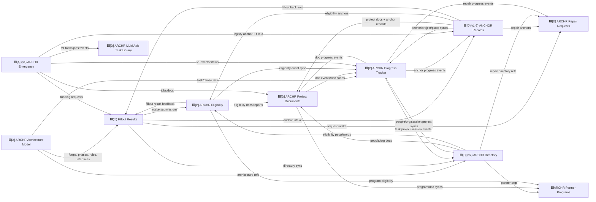

## Per-Base Diagrams

### 🟦(📗) Fillout Results

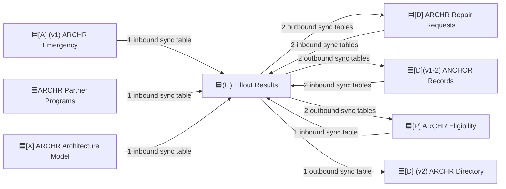

Fillout is the intake and raw-submission hub. It receives reference/sync data from model, eligibility, partner, anchor, repair, and emergency bases, then pushes cleaned intake/request/submission tables into eligibility, repair requests, ANCHOR, and directory flows.

- Tables mapped: 12
- Automation surface: 5 trigger tables, 5 write tables, 5 read tables
- Linked record surface: 12 tables

### 🟦[A] (v1) ARCHR Emergency

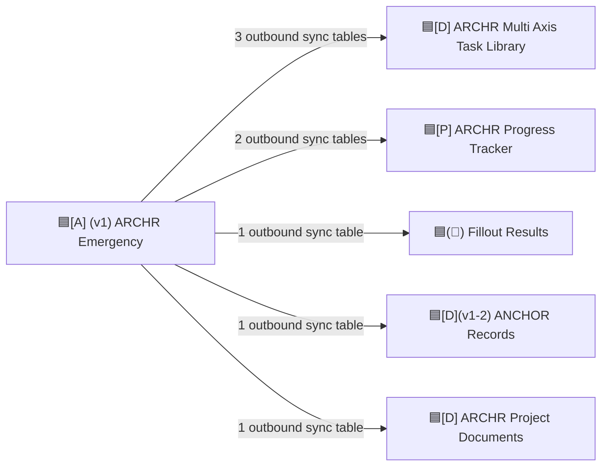

The v1 emergency base acts mainly as a source into shared systems: task library, progress events, documents, ANCHOR, and Fillout-derived request flows.

- Tables mapped: 6
- Automation surface: none shown in this CSV
- Linked record surface: none shown in this CSV

### 🟦[A] (v2) ARCHR Applicants

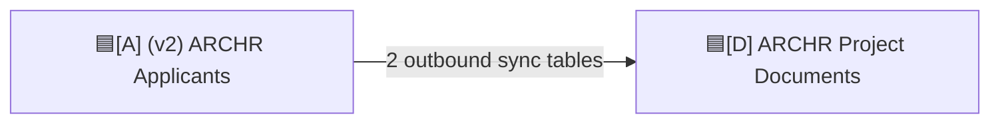

The v2 applicants base feeds applicant home and FEMA/HOI/attestation data into the project document system.

- Tables mapped: 2
- Automation surface: none shown
- Linked record surface: none shown

### 🟦[D] (v1) ARCHR Disaster Funding Sources

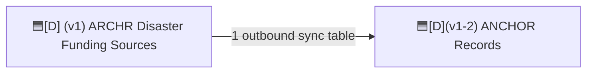

The disaster funding source base contributes draw request data into ANCHOR records.

- Tables mapped: 1
- Automation surface: none shown
- Linked record surface: none shown

### 🟦[D] (v2) AAHH Traditional Home Repair

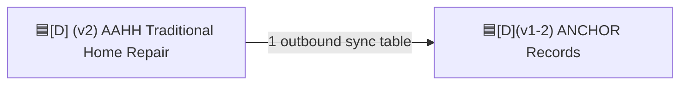

The AAHH traditional home repair base contributes CS/NRI data into ANCHOR records.

- Tables mapped: 1
- Automation surface: none shown
- Linked record surface: none shown

### 🟦[D] (v2) ARCHR Directory

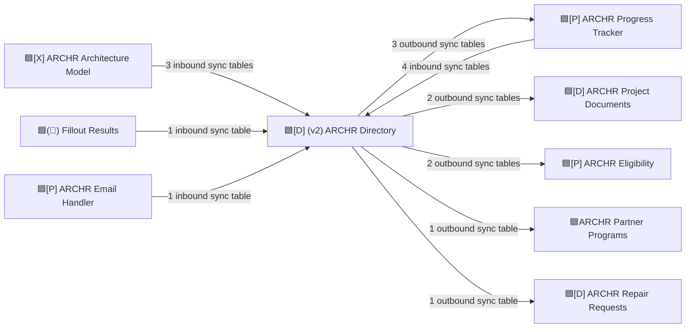

Directory is the people/org/session/project coordination layer. It receives architecture definitions and progress events, then republishes people, organizations, projects, sessions, and eligibility/reporting joins across the operational bases.

- Tables mapped: 12
- Automation surface: 6 trigger tables, 6 write tables, 4 read tables
- Linked record surface: 11 tables

### 🟦[D] ARCHR Multi Axis Task Library

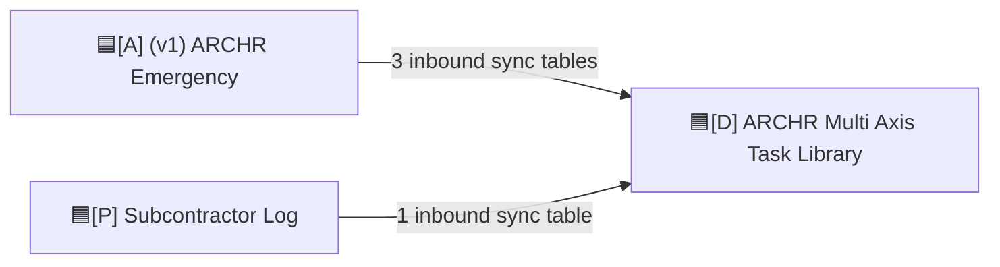

The task library receives v1 task/job/library data and subcontractor task data. In this CSV it appears as a sink rather than a source.

- Tables mapped: 4
- Automation surface: none shown
- Linked record surface: 4 tables

### 🟦[D] ARCHR Project Documents

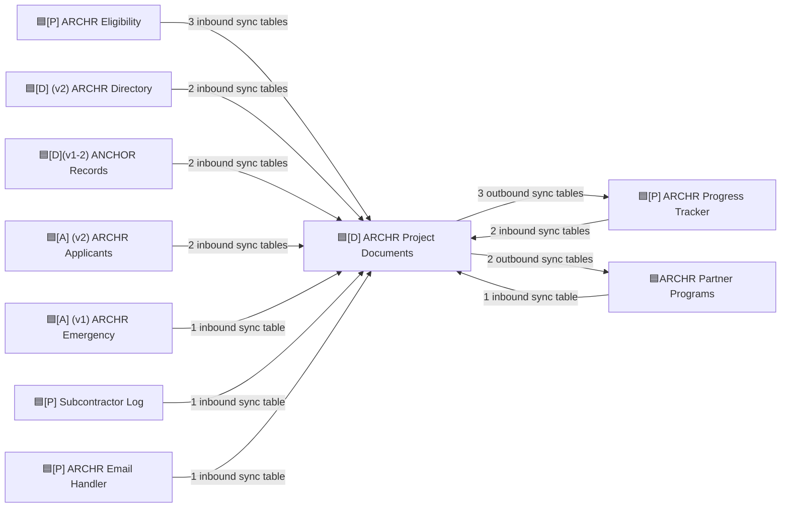

Project Documents is the document/document-event hub. It receives applicant, eligibility, anchor, directory, email, subcontractor, emergency, partner, and progress context, then pushes document events and document-code/program data back to Progress Tracker and Partner Programs.

- Tables mapped: 19
- Automation surface: 7 trigger tables, 7 write tables, 6 read tables
- Linked record surface: 16 tables

### 🟦[D] ARCHR Repair Requests

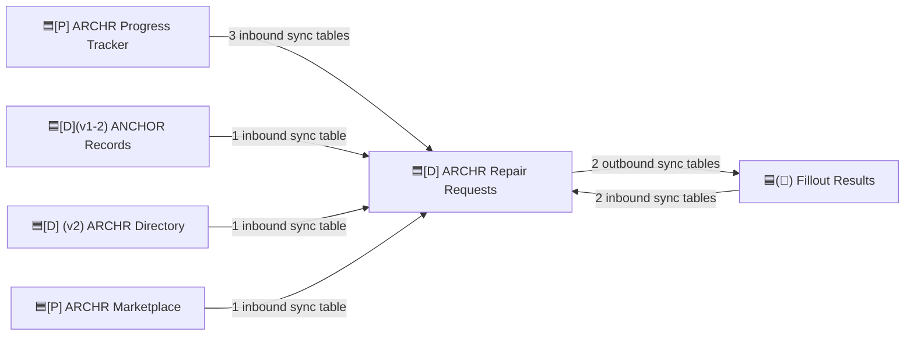

Repair Requests consolidates request intake, marketplace events, anchor links, directory context, and progress status. It also sends repair/request tables back toward Fillout.

- Tables mapped: 10
- Automation surface: none shown
- Linked record surface: 7 tables

### 🟦[D] ARCHR Reports

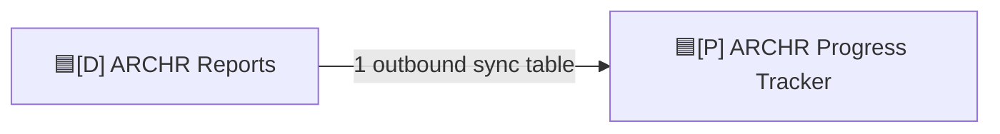

Reports contributes financial/reporting progress data into Progress Tracker.

- Tables mapped: 1
- Automation surface: none shown
- Linked record surface: none shown

### 🟦[D] DSW Updates Sheet

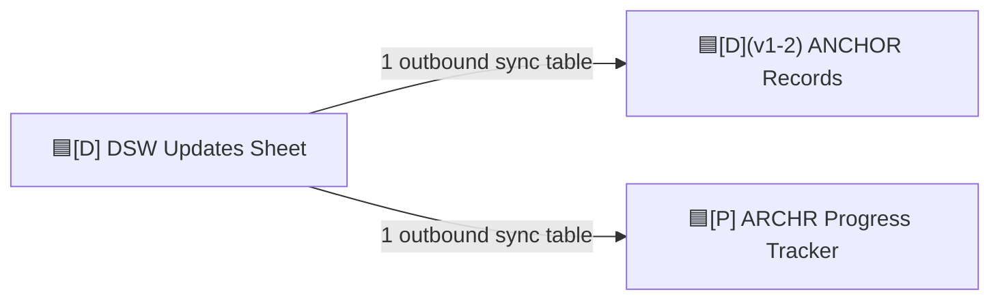

DSW updates are shared into both ANCHOR and Progress Tracker.

- Tables mapped: 2
- Automation surface: none shown
- Linked record surface: none shown

### 🟦[D](v1-2) ANCHOR Records

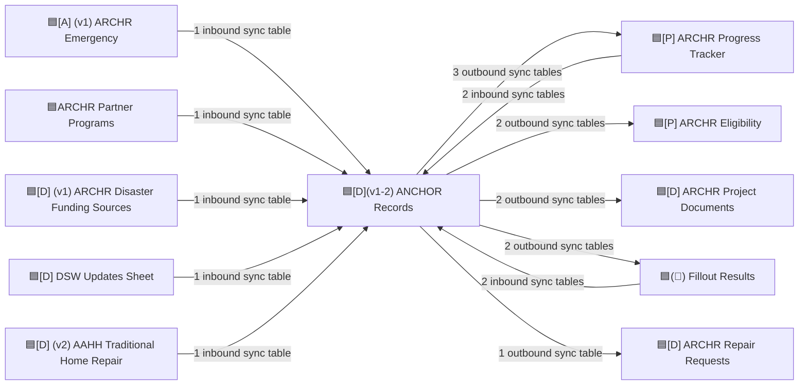

ANCHOR is a central record spine for projects, places, dates, DSW updates, draw requests, and anchor/project backlinks. It both receives project context and republishes anchor-level relationships to Progress Tracker, Documents, Eligibility, Fillout, and Repair Requests.

- Tables mapped: 12
- Automation surface: 7 trigger tables, 6 write tables, 7 read tables
- Linked record surface: 12 tables

### 🟦[P] ARCHR Eligibility

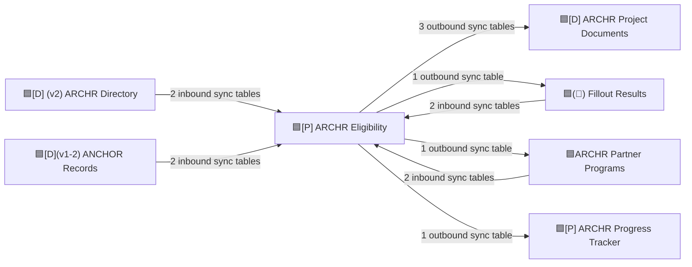

Eligibility sits between intake, programs, directory identity, ANCHOR records, reports, and project documents. It pushes eligibility/report/document context to Project Documents and Progress Tracker while also maintaining partner and Fillout feedback loops.

- Tables mapped: 10
- Automation surface: 3 trigger tables, 5 write tables, 3 read tables
- Linked record surface: 9 tables

### 🟦[P] ARCHR Email Handler

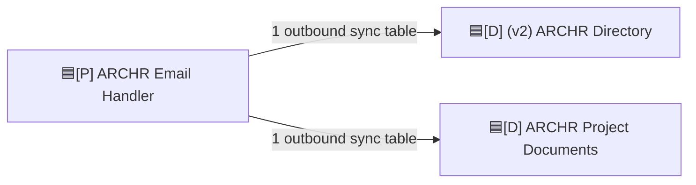

Email Handler sends received-message and alert-log data into Directory and Project Documents.

- Tables mapped: 2
- Automation surface: none shown
- Linked record surface: none shown

### 🟦[P] ARCHR Marketplace

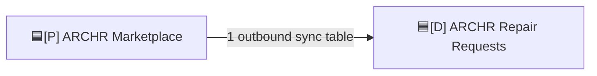

Marketplace events feed Repair Requests.

- Tables mapped: 1
- Automation surface: none shown
- Linked record surface: none shown

### 🟦[P] ARCHR Progress Tracker

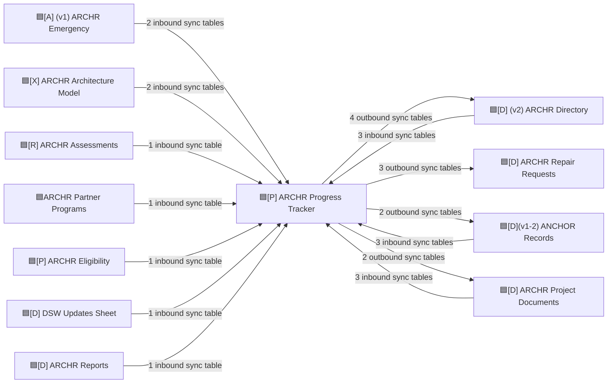

Progress Tracker is the cross-system event and task state hub. It receives events from documents, directory, ANCHOR, emergency, model, assessments, eligibility, DSW, reports, and partner programs, then republishes task/project/session/anchor/document progress state back to Directory, Repair Requests, ANCHOR, and Project Documents.

- Tables mapped: 19
- Automation surface: 13 trigger tables, 3 write tables, 14 read tables
- Linked record surface: 19 tables

### 🟦[P] Subcontractor Log

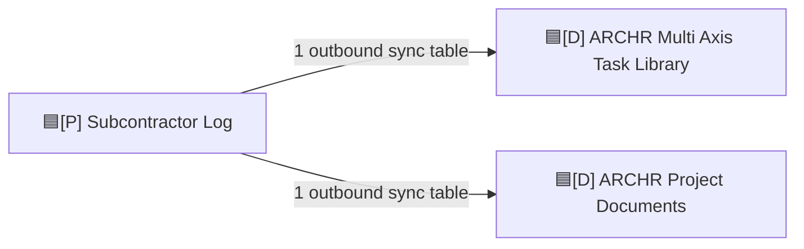

Subcontractor jobs/tasks feed the task library and project document system.

- Tables mapped: 2
- Automation surface: none shown
- Linked record surface: none shown

### 🟦[R] ARCHR Assessments

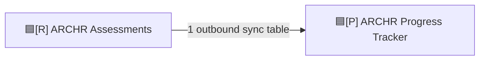

Assessment reports feed Progress Tracker.

- Tables mapped: 1
- Automation surface: none shown
- Linked record surface: none shown

### 🟦[X] ARCHR Architecture Model

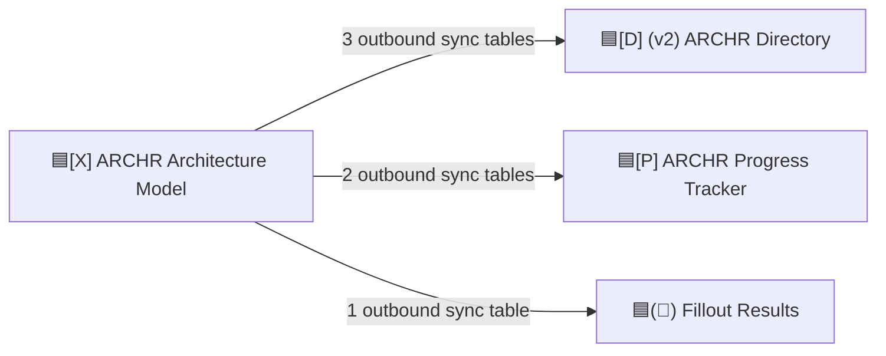

Architecture Model publishes definitions for progress tasks, roles, phases, interfaces, and Fillout forms into the runtime bases.

- Tables mapped: 5
- Automation surface: none shown
- Linked record surface: none shown

### 🟦ARCHR Partner Programs

```mermaid
flowchart LR
  base["🟦ARCHR Partner Programs"]
  docs["🟦[D] ARCHR Project Documents"] -->|"2 inbound sync tables"| base
  directory["🟦[D] (v2) ARCHR Directory"] -->|"1 inbound sync table"| base
  eligibility["🟦[P] ARCHR Eligibility"] -->|"1 inbound sync table"| base
  base -->|"2 outbound sync tables"| eligibility
  base -->|"1 outbound sync table"| anchor["🟦[D](v1-2) ANCHOR Records"]
  base -->|"1 outbound sync table"| fillout["🟦(📗) Fillout Results"]
  base -->|"1 outbound sync table"| docs
  base -->|"1 outbound sync table"| progress["🟦[P] ARCHR Progress Tracker"]
```

Partner Programs is a program/organization reference base with loops into Eligibility, ANCHOR, Fillout, Documents, and Progress Tracker.

- Tables mapped: 6
- Automation surface: none shown in this CSV
- Linked record surface: 5 tables

## High-Level Roles

- **Reference/config publishers:** Architecture Model, Partner Programs, Multi Axis Task Library.
- **Intake and source capture:** Fillout Results, Email Handler, Marketplace, Applicant bases, DSW Updates, Assessments.
- **Operational record hubs:** Directory, ANCHOR Records, Repair Requests, Eligibility.
- **Document hub:** Project Documents.
- **Event/task hub:** Progress Tracker.

## Notes and Caveats

- The Sync Map CSV describes discovered table-level relationships. It does not prove direction of individual field formulas or automation side effects beyond the explicit sync parent/child and automation read/write columns.
- Some bases are both upstream and downstream of each other. Those are intentional feedback loops, especially around Fillout, ANCHOR, Eligibility, Project Documents, and Progress Tracker.
- Automation counts are local table counts with automation metadata, not automation step counts.
