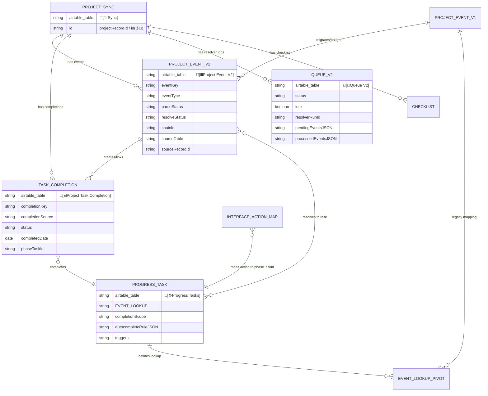
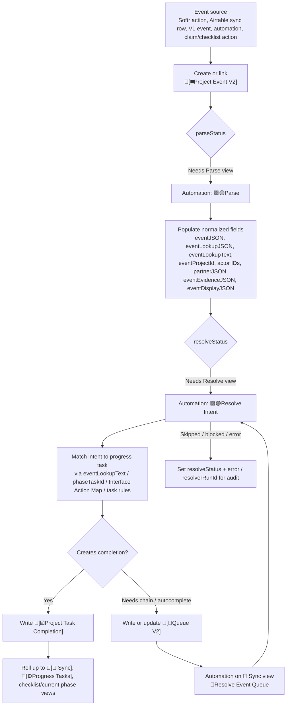
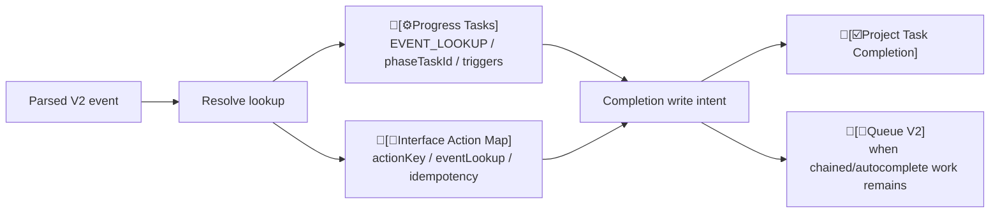
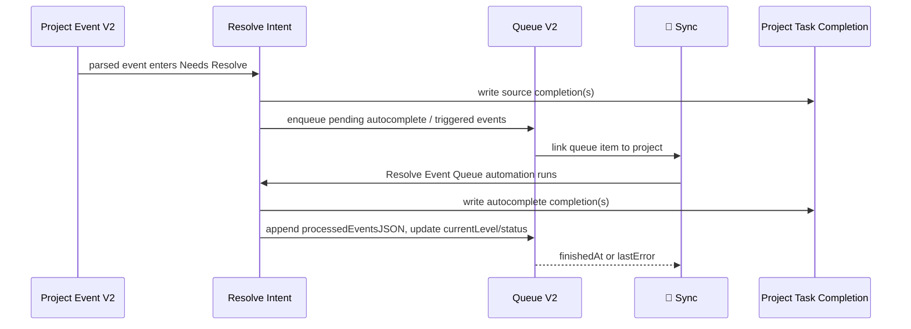
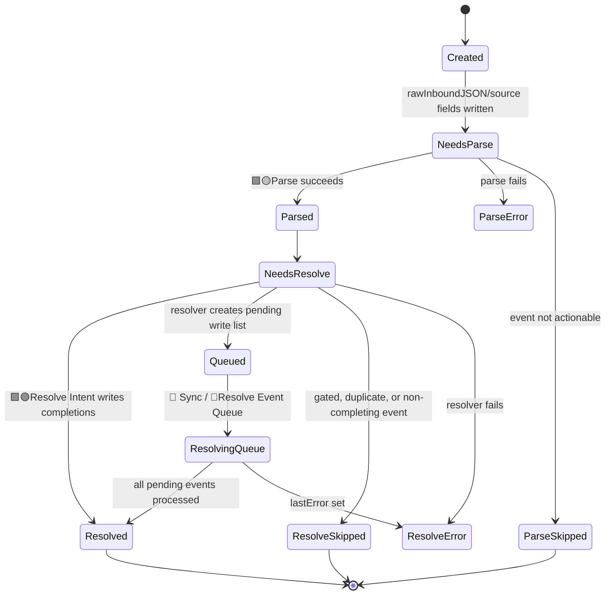

# Progress Event Tracking V2

Source: `C:\Users\bwyatt\Downloads\🔷Tables-progress tracker.csv`, exported from `[P] ARCHR Progress Tracker`.

This document describes the V2 progress event process as inferred from the table inventory, field names, linked-record fields, views, and automation trigger metadata in the progress tracker base. Where behavior depends on automation/script bodies that are not in the CSV, the document labels the behavior as inferred.

## Purpose

Progress tracking V2 turns user actions, sync records, migrated V1 events, and automation-generated events into canonical project progress records.

The V2 process separates four concerns that were blended together in V1:

| Concern | Main table | Purpose |
|---|---|---|
| Raw/canonical event record | `🔷[◼️Project Event V2]` | Capture inbound event payloads, parse them, resolve intent, and link evidence/actors/project context. |
| Project/task completion fact | `🔷[☑️Project Task Completion]` | Store the durable fact that a project task was completed, skipped, inferred, or otherwise resolved. |
| Task catalog and dependency rules | `🔶[⚙️Progress Tasks]` | Define phase tasks, event lookup keys, completion scopes, autocomplete rules, triggers, required evidence, and parent/child task relationships. |
| Resolver queue | `🔷[🔮Queue V2]` | Coordinate multi-step event resolution, chained/autocomplete writes, retries, lock state, and audit/error state. |

## Core Tables

| Table | Table ID | Role in V2 |
|---|---:|---|
| `🔶[🎯 Sync]` | `tbl4HhGi7F6lKzhfB` | Project-level hub. Links project records to V2 events, task completions, queue records, checklists, claims, and setup. |
| `🔷[◼️Project Event]` | `tblJpKhigM6vcRiwm` | Legacy/V1 event table and bridge. Contains migration views such as `toV2`, `toV2 copy`, and `🟣 V2 Migration Queue`. |
| `🔷[◼️Project Event V2]` | `tblOhnfdIlabxXOqL` | V2 event inbox and canonical event log. Automation views: `🟡 Needs Parse` and `🟣 Needs Resolve`. |
| `🔷[☑️Project Task Completion]` | `tbl1mIQg2utmj7Vqt` | Normalized completion records linked to project, event, and progress task. |
| `🔷[🔮Queue V2]` | `tblr1T9FrTtqMefV7` | Resolver work queue linked to `🎯 Sync`. |
| `🔶[⚙️Progress Tasks]` | `tblECgtClvoenWXJn` | Canonical task definitions and event lookup mapping. |
| `🔷_EVENT_LOOKUP_PIVOT_` | `tbl4Uf5fAdiBUIE2C` | V1-style lookup bridge between project events and progress tasks. Still useful as migration/reference context. |
| `🔷[🧭Interface Action Map]` | `tblDyFlcFI2816ZQu` | Interface-to-event registry: action keys, event lookup, event type, phase task ID, roles, prerequisites, blocking rules, and idempotency mode. |

## Data Model

## Event Lifecycle

### 1. Event Intake

V2 event intake appears to come from several places:

| Source pattern | Evidence in CSV |
|---|---|
| Project-level actions | `🔶[🎯 Sync]` has event-oriented views such as `addSubmissionEvent`, `🔮Add to Queue`, `🔮Resolve Event Queue`, `Create [🏁Checklist Record]`, `💛UPDATE_CLAIM`, and multiple `[🎯>🏁>...] Sync` views. |
| Legacy/V1 event migration | `🔷[◼️Project Event]` has `toV2`, `toV2 copy`, and `🟣 V2 Migration Queue` views, and links to `[◼️Project Event V2]`. |
| Checklist actions | `🔷[🏁✔️Checklist Items]` has `Marked Complete` views and completion fields; V2 completions link back to `🎯 Sync` and `⚙️Progress Tasks`. |
| Domain sync tables | Tables such as `🔶[✅Sync]`, `🔶[🔍Sync]`, `🔷[💬Sync]`, and `🔷[🪧Sync]` have `Create Project Event` or `Create Progress Event` views and `_EVENT_LOOKUP_` / `_EVENT_DATE_` fields. |
| Interface actions | `🔷[🧭Interface Action Map]` stores `actionKey`, `eventLookup`, `eventType`, `phaseTaskId`, prerequisites, blockers, evidence rules, and idempotency mode. |

The canonical V2 event record stores both raw and resolved data:

- Raw/source: `rawInboundJSON`, `sourceTable`, `sourceRecordId`, `sourceEventId`, `sourceUrl`, `datasource`, `sessionId`.
- Event identity: `eventKey`, `eventType`, `eventDate`, `chainId`, `triggeredByEventKey`, `triggeredByPhaseTaskId`.
- Project/actor context: linked `[🎯 Sync]`, `[💜Orgs]`, `[💜People]`, `🪝Claims`, `actorOrgId`, `actorPersonId`, `actorRole`, `eventProjectId`.
- Parsed/resolved payloads: `eventJSON`, `eventLookupJSON`, `eventLookupText`, `eventDisplayJSON`, `eventEvidenceJSON`, `eventResolutionJSON`, `partnerJSON`, `writeListJSON`.
- Workflow state: `parse`, `parseStatus`, `resolve`, `resolveStatus`, `resolverRunId`, `error`.

### 2. Parse

The `🔷[◼️Project Event V2]` table has a `🟡 Needs Parse` view wired to automation `🟪🟡Parse`.

Parse normalizes the event into structured V2 fields. Inferred responsibilities:

1. Read `rawInboundJSON` plus source metadata.
2. Determine `eventKey`, `eventType`, `eventDate`, and `eventProjectId`.
3. Produce lookup payloads: `eventLookupJSON` and `eventLookupText`.
4. Extract display/evidence payloads into `eventDisplayJSON` and `eventEvidenceJSON`.
5. Link known project, org, person, claim, and V1 event records when possible.
6. Set `parseStatus` to parsed, skipped, or error.

### 3. Resolve Intent

The same V2 table has a `🟣 Needs Resolve` view wired to automation `🟪🟣Resolve Intent`.

Resolve translates a parsed event into one or more write intents:

Resolution uses task and action metadata:

- `⚙️Progress Tasks.EVENT_LOOKUP` and `eventLookupNormalized` map event labels to phase tasks.
- `⚙️Progress Tasks.completionScope` defines what counts as complete.
- `⚙️Progress Tasks.autocompleteRuleJSON`, `Triggers Completion Of`, `triggers`, `triggerEvent`, and `TriggeredEvents` define chained completion logic.
- `⚙️Progress Tasks.requiresEvidence` controls whether an event can complete the task without supporting evidence.
- `Interface Action Map.phaseTaskId` maps product actions directly to phase tasks.
- `Interface Action Map.requiresCompletedPhaseTaskIdsJSON` and `blocksIfCompletedPhaseTaskIdsJSON` provide workflow gating.
- `Interface Action Map.idempotencyMode` describes duplicate/retry handling for an action.

### 4. Completion Write

The durable outcome of resolution is a record in `🔷[☑️Project Task Completion]`.

Important completion fields:

| Field | Meaning |
|---|---|
| `[🎯 Sync]` | Project this completion belongs to. |
| `[◼️Project Event V2]` | Event that created or justified this completion. |
| `[⚙️Progress Tasks]` | Phase task completed by the event. |
| `completionKey` | Idempotency key for the project/task/event completion fact. |
| `completionSource` | Indicates whether the completion came from the source event or autocomplete/inference. Views include `completionSource="source"` and `completionSource="autocomplete"`. |
| `status` | Completion state. Likely supports active/complete/skipped/error-style statuses depending on resolver output. |
| `completedDate` | Effective completion date. |
| `completedByEventKey` / `completedByEventRecordId` | Trace back to the creating event. |
| `resolverRunId` | Trace back to the resolver execution. |
| `rawEventJSON`, `eventLookupText`, `partnerJSON`, `notes` | Audit and reporting context. |

The key V2 design choice is that progress is not only inferred from the latest event row. It is materialized as explicit completion facts, which can be rolled up, audited, deduped, and displayed.

### 5. Queue and Chained Resolution

`🔷[🔮Queue V2]` stores resolver work at the project level. The table links to `[🎯 Sync]` and includes:

- `status`
- `lock`
- `currentLevel`
- `chainId`
- `projectRecordId`
- `resolverRunId`
- `pendingEventsJSON`
- `processedEventsJSON`
- `startedAt`
- `finishedAt`
- `lastError`

The `🔶[🎯 Sync]` table has resolver views/automations:

- `🔮Add to Queue`
- `🔮Has WRITE_LIST`
- `🔮Resolve Event Queue` -> automation `🟪🔮Resolve Queue`
- `🔮Set Next Try`
- `🔮ResetTrigger`

Inferred queue process:

The queue gives V2 a controlled place for cascading writes. This matters because completing one phase task can imply downstream completions, unlock another action, or generate follow-up events.

## V2 State Machine

## Idempotency and Deduping

V2 appears to rely on explicit keys instead of only Airtable links:

- `eventKey` identifies the event.
- `completionKey` identifies the completion fact.
- `chainId` groups related events in a resolver chain.
- `sourceTable` + `sourceRecordId` + `sourceEventId` trace back to the origin.
- `completedByEventKey` + `completedByEventRecordId` preserve the write source.
- `Interface Action Map.idempotencyMode` tells the resolver how repeated UI/actions should be treated.

Recommended rule: a project should not receive two active `☑️Project Task Completion` records with the same `completionKey` unless the status model explicitly supports superseded/reversed completion records.

## Reporting and Rollups

The V2 model supports reporting through links and rollups:

- `🎯 Sync` links to `[◼️Project Event V2]`, `[☑️Project Task Completion]`, `[🔮Queue V2]`, `[🏁Checklist]`, `completeCountTable`, and `🕰️FQ Table`.
- `⚙️Progress Tasks` links to `[☑️Project Task Completion]` and has rollup fields such as `[🎯 Sync] Rollup`.
- `🏁Checklist` and checklist item records surface current phase/task status for human workflow.
- `completeCountTable` remains a bridge for count-style completion reporting, especially where V1 project events are still involved.

## V1 to V2 Bridge

V1 is still present in the model:

- `🔷[◼️Project Event]` has migration and compatibility views: `toV2`, `toV2 copy`, `🟣 V2 Migration Queue`, `New Events`, `anyComplete`, `completionEvidence`, `update [🏁Progress]`.
- `🔷_EVENT_LOOKUP_PIVOT_` links V1 `Project Event` records to `⚙️Progress Tasks`.
- `🔶[🎯 Sync]` still contains rollups/fields for `[⬛] Project Event`, `_EVENT_LOOKUP_PIVOT_`, `[🟥Status Changes]`, and v1 status updates.

The practical migration path is:

1. Keep V1 project events as source/audit records.
2. Create corresponding `Project Event V2` records from V1 migration views.
3. Parse and resolve V2 records.
4. Materialize completions in `Project Task Completion`.
5. Prefer V2 completions for new progress calculations; use V1 pivots only for backfill/compatibility until retired.

## Operational Checklist

Use this checklist when debugging progress tracking:

1. Find the project in `🔶[🎯 Sync]`.
2. Check linked `🔷[◼️Project Event V2]` records.
3. If an event did not process, inspect `parseStatus`, `resolveStatus`, `error`, `rawInboundJSON`, and `eventLookupText`.
4. If parse is pending, check whether the record is in `🟡 Needs Parse`.
5. If resolve is pending, check whether the record is in `🟣 Needs Resolve`.
6. If a chained action is missing, check linked `🔷[🔮Queue V2]` records for `status`, `lock`, `pendingEventsJSON`, `processedEventsJSON`, and `lastError`.
7. If progress is not showing complete, check `🔷[☑️Project Task Completion]` for the expected `completionKey`, `phaseTaskId`, `[⚙️Progress Tasks]` link, and `[🎯 Sync]` link.
8. If the event cannot match a task, inspect `🔶[⚙️Progress Tasks].EVENT_LOOKUP`, `eventLookupNormalized`, `phaseTaskId`, and related `🔷[🧭Interface Action Map]` records.

## Open Questions

These need automation/script bodies or sample records to confirm:

- Exact allowed values for `parseStatus`, `resolveStatus`, `completionSource`, queue `status`, and completion `status`.
- Whether `completionKey` is enforced by automation, Airtable constraints, or resolver logic only.
- How reversals/withdrawals are represented: negative event, superseded completion, status change, or deletion.
- Whether `writeListJSON` is authoritative for queue writes or a diagnostic artifact.
- Which V1 event types are still active versus migration-only.
